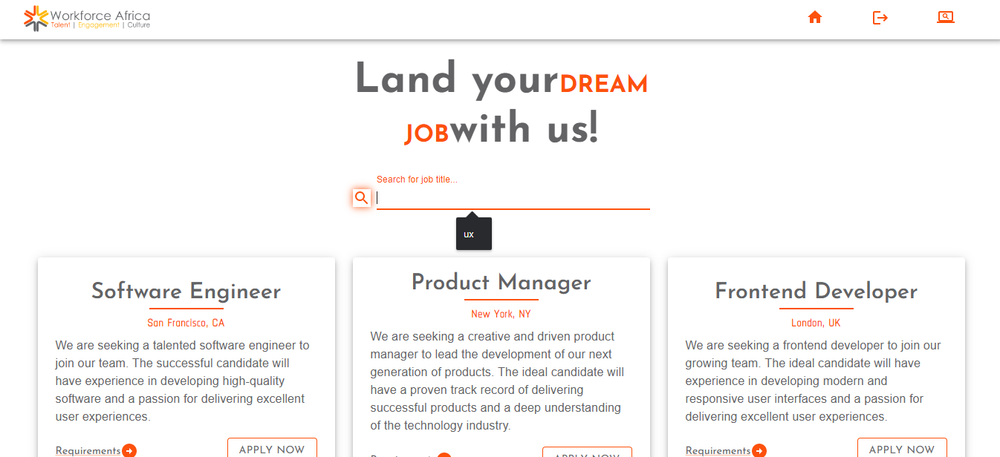

<h1 align='center'>WorkForce Africa | Job Search</h1>

The website allows you to sign in using your google account and access various job openings offered by the WorkForce Africa.

> Features:

- Authentication using oAuth2 by google using firebase as Baas

- Search functionality that allows users to search for job openings by keywords and titles

- Beautifully displayed UI with a good UX that copies the WorkForce Africa Brand Theme

- Designed by Figma

> Snippet:

> Libraries and FrameWorks used.

- ReactJS for building the interactive UI

- Used Material UI v6 for Styling of the application

- Implemented Context API for state management

- Used Firebase as Baas to implement oAuth2

- React Router for routing of the pages

- Framer motion for animation
